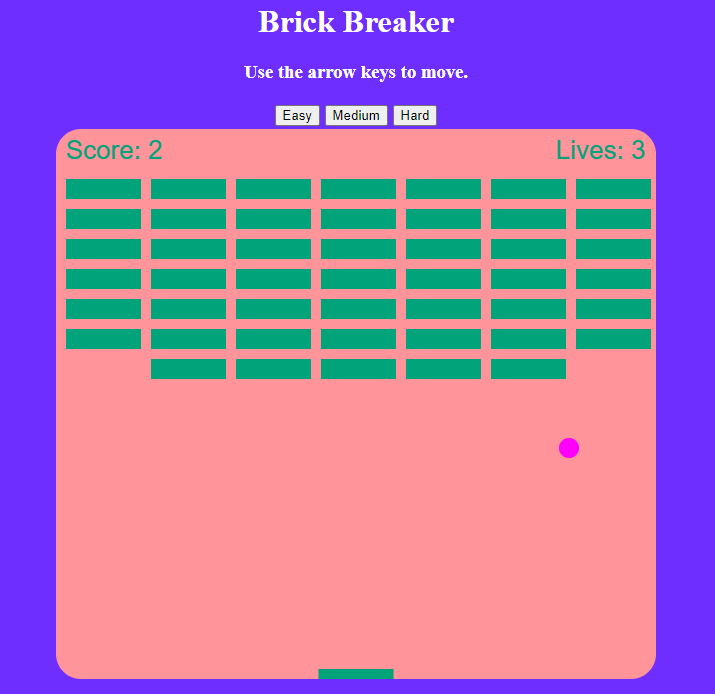

# BrickBreaker
This a brick breaker app

 

This is a free and fun interactive game that takes you back to your childhood. Specifically those days when you arnt sure what to play and cool math had your back.

I decided to make a Brick Breaker because as I was going through a list of examples it really popped out at me. All of the other ones seemed to have a boring outcome to me, however breaking things always seems fun to me.

###Part one
To start out making the game I first made my header and established the title and the stylesheet.

 

After that i initiated my canvas along with the radius of the ball that i am going to use and how fast i want the ball to move. 

###Part two

 

After i declaired the radius of the ball i then had to declare the path of the ball as well as the math of how the ball moved, the color of the ball, paint the ball that color and then to end the path that the ball went 
  

 

